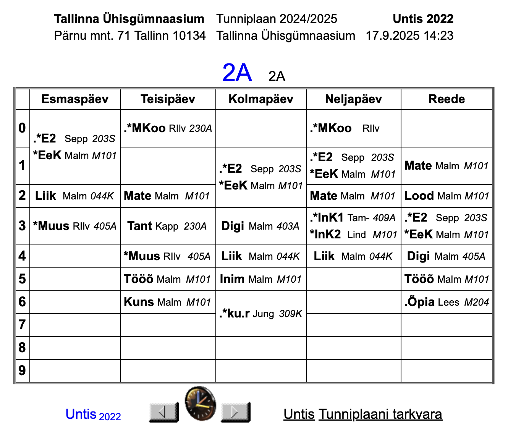
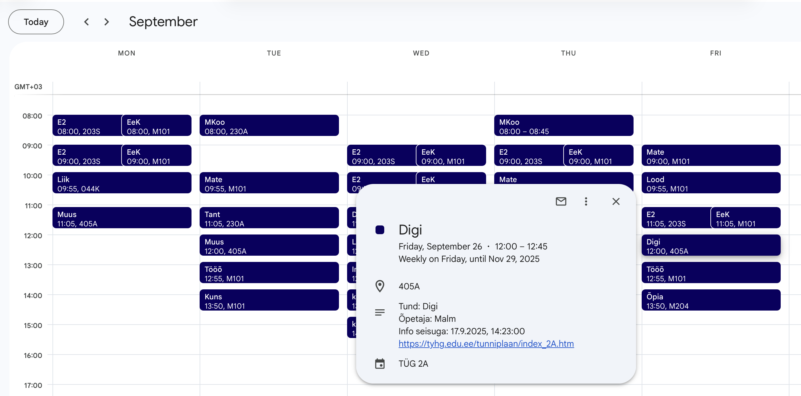

# Tallinna Ühisgümnaasiumi tunniplaan

Skript, mis tekitab Tallinna Ühisgümnaasiumi kodulehelt leiduvast tunniplaanist kalendrisse (Google Calendar, Apple Calendar jm) imporditava faili.

Tunniplaanid pärinevad siit: https://tyhg.edu.ee/tunniplaan/

Näide tunniplaanist kodulehel:

Tulemus Google Calendar rakenduses:

